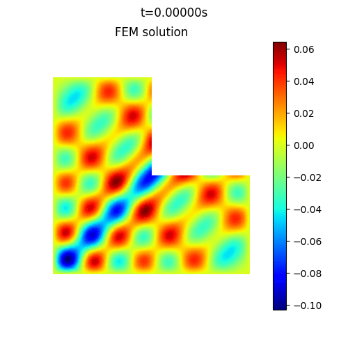

# Torch-FEM:rocket:

A fast:rocket:, differentiable:dart:, cross-platform:computer:, jit-free:pushpin:, debugging-friendly:rotating_light: Finite Element Method library 

---


## Document


## Feature


## Usage

```bash
pip install -r requirements.txt
python setup.py
```


## Examples

### Heat Equation

```bash
cd examples
python heat.py
```




### Wave Equation

```bash
cd examples
python wave.py
```


## Benchmark


## Contribution


