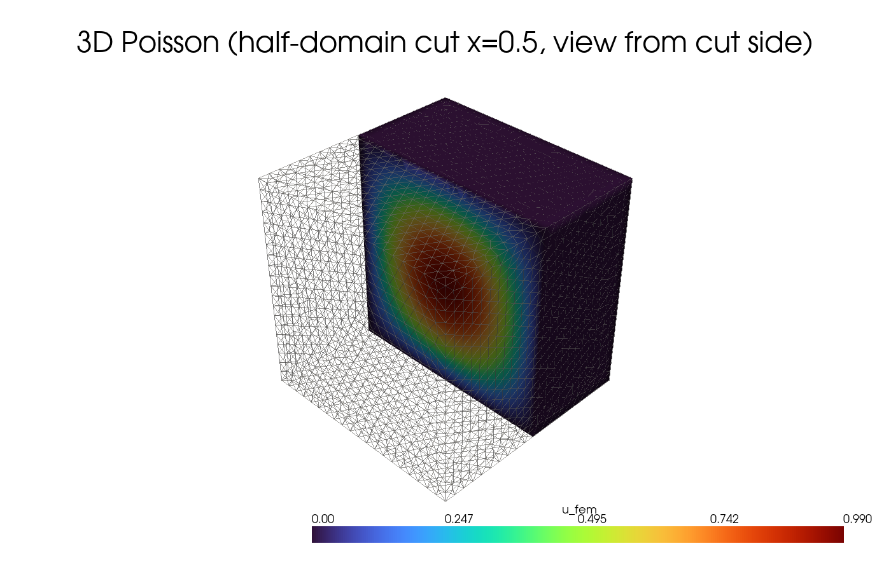
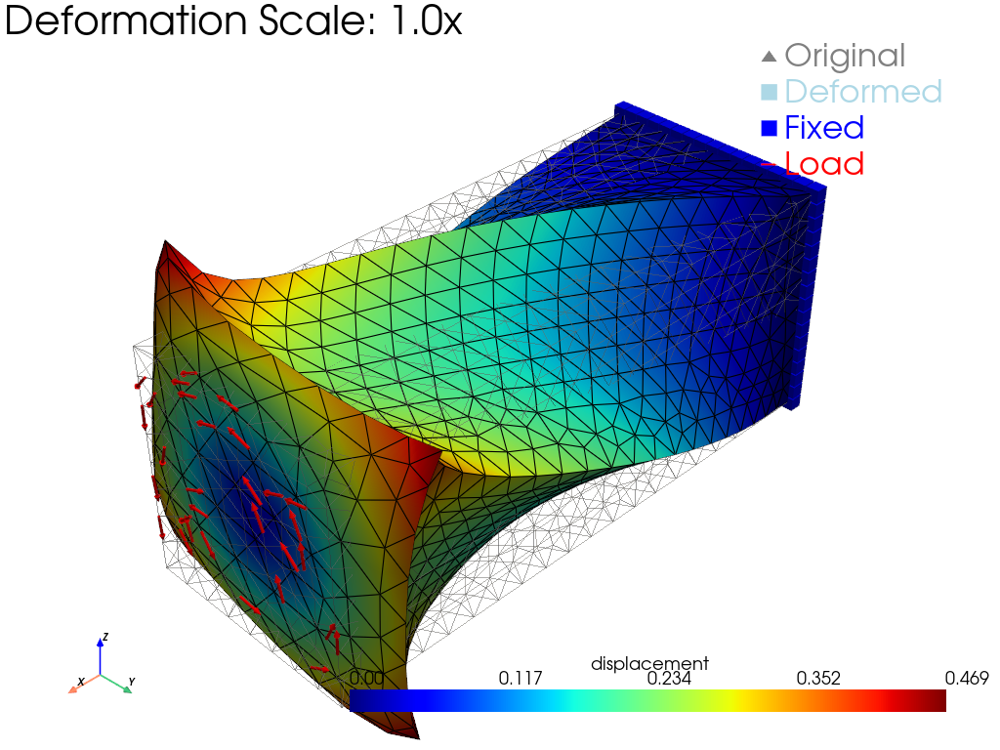
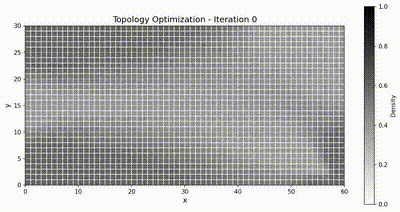

<p align="center">
  
</p>

<p align="center">
  <strong>A fast, differentiable, JIT-free, debugging-friendly finite element library for PyTorch.</strong>
</p>

<p align="center">
  <a href="https://docs.tensor-mesh.com/">Documentation</a> &nbsp;|&nbsp;
  <a href="#installation">Installation</a> &nbsp;|&nbsp;
  <a href="#quickstart">Quickstart</a> &nbsp;|&nbsp;
  <a href="#examples">Examples</a> &nbsp;|&nbsp;
  <a href="#citation">Citation</a>
</p>

<p align="center">
  <!-- TODO: replace with real shields.io badges once PyPI / CI / docs are live -->
  
  
  
  
  
  
</p>

---

TensorMesh is a finite element method (FEM) library built natively on PyTorch.
It is designed to solve partial differential equations (PDEs) with the
ergonomics of modern deep learning frameworks — automatic differentiation,
GPU acceleration, eager execution — without sacrificing the rigour of
classical FEM. Custom weak forms are written in pure Python; the library
takes care of tensorized assembly, sparse linear algebra, boundary
conditions, and time integration.

TensorMesh is the FEM solver component of the
[**TensorGalerkin**](https://arxiv.org/abs/2602.05052) framework, and is
powered by [**torch-sla**](https://www.torchsla.com/) for differentiable
sparse linear algebra.

## Core strengths

- **GPU-native & differentiable.** Built on PyTorch from the ground up.
  Autograd flows seamlessly through mesh, assembly, and solve, enabling
  end-to-end differentiable PDE pipelines with GPU acceleration.
- **High-performance tensorized assembly.** A fully tensorized Map-Reduce
  algorithm fuses element-wise operations into monolithic GPU kernels,
  eliminating Python-level loops and delivering order-of-magnitude
  speedups over CPU-based FEM stacks.
- **JIT-free & debugging-friendly.** Pure eager execution. Dynamic meshes,
  adaptive refinement, and interactive workflows just work — no
  recompilation latency, no opaque traces, debug with standard Python tools.
- **Pythonic API.** Custom weak forms in pure Python — no separate DSL,
  no form compiler. If you can write PyTorch, you can write FEM.
- **Comprehensive elements.** Lines, triangles, quadrilaterals, tetrahedra,
  hexahedra, pyramids, and prisms — all up to geometric order 4. Mixed
  meshes (e.g. triangles + quads together) are supported natively.
- **Flexible solvers.** Sparse direct and iterative solvers across SciPy,
  PyTorch, Eigen, CuPy, cuDSS, and PETSc backends, with full autograd and
  batched-RHS support.

## Installation

**Requirements:** Python ≥ 3.10, PyTorch ≥ 2.0.

```bash
pip install tensor-mesh
```

For GPU sparse solves, install `torch-sla` with the `[cuda]` extra:

```bash
pip install "torch-sla[cuda]>=0.2.0"
```

<details>
<summary>Install from source (for development)</summary>

```bash
git clone https://github.com/camlab-ethz/TensorMesh.git
cd TensorMesh
pip install -e ".[test]"
```
</details>

<details>
<summary>Optional extras</summary>

```bash
pip install "tensor-mesh[petsc]"    # PETSc solver backend
pip install "tensor-mesh[cupy]"     # CuPy GPU backend (legacy)
pip install "tensor-mesh[example]"  # Plotly for example notebooks
pip install gmsh                    # external mesh generation / .msh I/O
pip install pyvista                 # interactive 3D visualization
```
</details>

After installing, sanity-check the install:

```bash
python -m tensormesh.verify_install
```

## Quickstart

Solve $-\Delta u = f$ on the unit square with homogeneous Dirichlet
boundary conditions, where $f(x, y) = 2\pi^2\sin(\pi x)\sin(\pi y)$ so
the exact solution is $u(x, y) = \sin(\pi x)\sin(\pi y)$:

```python
import math
import torch
from tensormesh import ElementAssembler, NodeAssembler, Mesh, Condenser

# 1. Generate a triangular mesh of the unit square.
mesh = Mesh.gen_rectangle(chara_length=0.05)

# 2. Stiffness weak form:  a(u, v) = ∫ ∇u · ∇v dΩ
class LaplaceAssembler(ElementAssembler):
    def forward(self, gradu, gradv):
        return gradu @ gradv

# 3. Load weak form:  l(v) = ∫ f v dΩ
class SourceAssembler(NodeAssembler):
    def forward(self, v, f):
        return f * v

# 4. Source term, evaluated at every mesh node.
x, y = mesh.points[:, 0], mesh.points[:, 1]
f_vals = 2 * math.pi**2 * torch.sin(math.pi * x) * torch.sin(math.pi * y)

# 5. Assemble the stiffness matrix and load vector.
K = LaplaceAssembler.from_mesh(mesh)()
b = SourceAssembler.from_mesh(mesh)(point_data={"f": f_vals})

# 6. Apply Dirichlet BCs by static condensation, then solve.
condenser = Condenser(mesh.boundary_mask)
K_, b_ = condenser(K, b)
u = condenser.recover(K_.solve(b_))

# 7. Compare against the analytical solution.
u_exact = torch.sin(math.pi * x) * torch.sin(math.pi * y)
print(f"L2 error: {(u - u_exact).norm() / u_exact.norm():.3e}")
```

```
L2 error: 3.162e-03
```

The workflow is **Mesh → Assembler → SparseMatrix → Condenser → Solve**.
Move everything to GPU with a single `mesh = mesh.cuda()`; enable
gradients with `mesh.points.requires_grad_(True)` and the same script
becomes an inverse problem.

See the full walkthrough in the
[Quickstart](https://docs.tensor-mesh.com/getting_started/quickstart.html).

## Examples

A small selection from the
[example gallery](https://docs.tensor-mesh.com/example_gallery/index.html):

<table>
  <tr>
    <td align="center" width="33%">
      <br/>
      <sub><b>3D Poisson</b> — tetrahedral mesh, cut view of the scalar field.</sub>
    </td>
    <td align="center" width="33%">
      <br/>
      <sub><b>Heat equation</b> — implicit-Euler time stepping; FEM (left) vs analytical (right).</sub>
    </td>
    <td align="center" width="33%">
      <br/>
      <sub><b>Wave equation</b> — explicit central-difference time integration.</sub>
    </td>
  </tr>
  <tr>
    <td align="center">
      <br/>
      <sub><b>Lid-driven cavity</b> — incompressible Navier–Stokes; velocity field and streamlines.</sub>
    </td>
    <td align="center">
      <br/>
      <sub><b>Hyperelastic rubber</b> — large-deformation solid mechanics with a Newton solver.</sub>
    </td>
    <td align="center">
      <br/>
      <sub><b>Topology optimization</b> — compliance minimization via the Optimality Criteria method.</sub>
    </td>
  </tr>
</table>

| Category | Path | Description |
|---|---|---|
| **Basics** | [`examples/basics/`](examples/basics) | Mesh visualization, basis functions, element gallery |
| **Poisson** | [`examples/poisson/`](examples/poisson) | 2D / 3D Poisson, batched RHS, h-adaptivity |
| **Diffusion** | [`examples/diffusion/`](examples/diffusion) | Heat equation, Allen-Cahn phase field |
| **Wave** | [`examples/wave/`](examples/wave) | Wave equation with central-difference scheme |
| **Dataset** | [`examples/dataset/`](examples/dataset) | Batch dataset generation for ML (heat, wave, Poisson) |
| **Fluid** | [`examples/fluid/`](examples/fluid) | Lid-driven cavity, cylinder flow, Rayleigh-Bénard, Taylor-Green |
| **Solid** | [`examples/solid/`](examples/solid) | Cantilever beam, hyperelasticity, contact, plasticity |
| **Distributed** | [`examples/distributed/`](examples/distributed) | Graph coloring, mesh partitioning, multi-GPU assembly |

## Feature comparison

| Feature                       | FEniCS | scikit-fem | JAX-FEM | torch-fem | **TensorMesh** |
| :---                          | :---:  | :---:      | :---:   | :---:     | :---:          |
| Custom weak forms (Pythonic)  | ⚠️     | ✅         | ❌      | ❌        | ✅             |
| Easy install                  | ❌     | ✅         | ⚠️      | ✅        | ✅             |
| Easy debug                    | ❌     | ✅         | ❌      | ✅        | ✅             |
| Easy I/O                      | ❌     | ❌         | ❌      | ❌        | ✅             |
| Large meshes                  | ✅     | ✅         | ❌      | ❌        | ✅             |
| GPU support                   | ✅     | ❌         | ✅      | ✅        | ✅             |
| Efficiency                    | ✅     | ❌         | ✅      | ⚠️        | ✅             |
| End-to-end autograd           | ⚠️     | ❌         | ✅      | ✅        | ✅             |
| Deep-learning integration     | ❌     | ❌         | ⚠️      | ✅        | ✅             |
| Maturity                      | ✅     | ✅         | ⚠️      | ⚠️        | ⚠️             |

> **Custom Weak Forms (Pythonic)** — user-defined bilinear / linear forms
> directly in Python, without a separate DSL such as UFL.
> **End-to-End Autograd** — gradients flow natively through the entire
> pipeline; FEniCS supports this via the external `dolfin-adjoint` package.
> **Maturity** — reflects project age, ecosystem size, and production
> deployments.

## Architecture

The core workflow: **Mesh → Assembler → SparseMatrix → Condenser → Solve**.

| Module                       | Description |
| ---                          | --- |
| `tensormesh.mesh`            | Mesh data structure; built-in generators (`gen_rectangle`, `gen_circle`, `gen_cube`, `gen_L`, …); Gmsh / VTK-HDF5 I/O |
| `tensormesh.element`         | Shape functions, quadrature rules, element transformations (geometric order 1–4) |
| `tensormesh.assemble`        | `ElementAssembler`, `NodeAssembler`, `FacetAssembler` for matrix and vector assembly |
| `tensormesh.sparse`          | `SparseMatrix` with multiple solver backends (SciPy / PyTorch / Eigen / cuDSS / CuPy / PETSc) |
| `tensormesh.operator`        | `Condenser` for Dirichlet boundary conditions via static condensation |
| `tensormesh.ode`             | Time integrators: explicit / implicit Euler, midpoint, Runge–Kutta |
| `tensormesh.dataset`         | Parametric PDE dataset generation (Poisson, Heat, Wave, linear elasticity) |
| `tensormesh.visualization`   | Matplotlib and PyVista plotting backends |
| `tensormesh.functional`      | Tensor utilities for FEM (elasticity, Voigt notation, common ops) |
| `tensormesh.material`        | Material property definitions for solid mechanics |
| `tensormesh.optimizer`       | Optimization algorithms (e.g. OC for topology optimization) |

## Documentation

Full documentation, including a user guide, an example gallery, the API
reference, and performance benchmarks, lives at
[**docs.tensor-mesh.com**](https://docs.tensor-mesh.com/).

Key entry points:

- [Getting started](https://docs.tensor-mesh.com/getting_started/index.html) — installation, quickstart, and an install smoke-test.
- [User guide](https://docs.tensor-mesh.com/user_guide/index.html) — meshes, weak forms, boundary conditions, linear solvers, time integration, differentiability.
- [Example gallery](https://docs.tensor-mesh.com/example_gallery/index.html) — runnable examples from Poisson to Navier–Stokes and topology optimization.
- [API reference](https://docs.tensor-mesh.com/api/index.html) — module-by-module signatures and docstrings.
- [Performance](https://docs.tensor-mesh.com/performance/index.html) — benchmarks against FEniCS / Firedrake / MFEM / scikit-fem / JAX-FEM / torch-fem.

## Community

- [Discord](https://discord.gg/qgZhyVh2) — real-time chat, help channels, and showcase.
- [GitHub Discussions](https://github.com/camlab-ethz/TensorMesh/discussions) — announcements, Q&A, ideas & RFCs.
- [GitHub Issues](https://github.com/camlab-ethz/TensorMesh/issues) — bug reports and feature requests.
- Email: [tensormesh.dev@gmail.com](mailto:tensormesh.dev@gmail.com) — collaborations and partnerships.

## Contributing

Contributions are welcome — see [`CONTRIBUTING.md`](CONTRIBUTING.md) for the
development setup, test workflow, documentation build, and PR conventions.

## Citation

TensorMesh is the FEM solver component of the **TensorGalerkin** framework.
If you use TensorMesh in your research, please cite the TensorGalerkin paper:

```bibtex
@article{wen2026tensorgalerkin,
  title   = {Learning, Solving and Optimizing PDEs with {TensorGalerkin}:
             an Efficient High-Performance Galerkin Assembly Algorithm},
  author  = {Wen, Shizheng and Chi, Mingyuan and Yu, Tianwei and
             Moseley, Ben and Michelis, Mike Yan and Ren, Pu and
             Sun, Hao and Mishra, Siddhartha},
  journal = {arXiv preprint arXiv:2602.05052},
  year    = {2026}
}
```

If your work also relies on `torch-sla` (TensorMesh's solver backend),
please additionally cite:

```bibtex
@article{chi2026torchsla,
  title   = {torch-sla: Differentiable Sparse Linear Algebra with Adjoint
             Solvers and Sparse Tensor Parallelism for PyTorch},
  author  = {Chi, Mingyuan and Wen, Shizheng},
  journal = {arXiv preprint arXiv:2601.13994},
  year    = {2026}
}
```

## License

TensorMesh is released under the [GNU General Public License v3.0](LICENSE).

## Acknowledgements

<p align="center">
  <a href="https://camlab.ethz.ch/"></a>
  &nbsp;&nbsp;&nbsp;
  <a href="https://ai.ethz.ch/"></a>
  &nbsp;&nbsp;&nbsp;
  <a href="https://ethz.ch/"></a>
</p>
