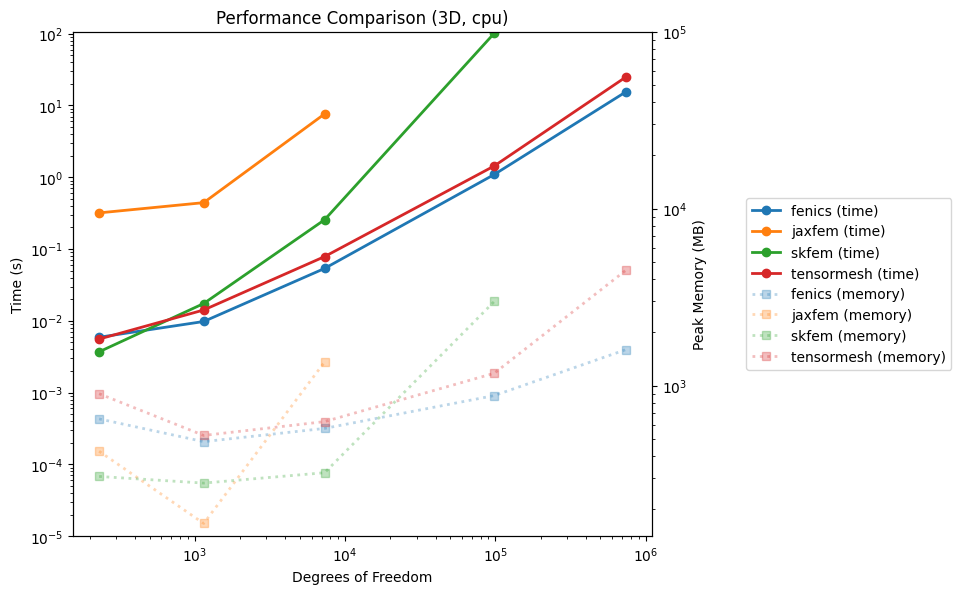

```bash

    ████████╗███████╗███╗   ██╗███████╗ ██████╗ ██████╗ ███╗   ███╗███████╗███████╗██╗  ██╗
    ╚══██╔══╝██╔════╝████╗  ██║██╔════╝██╔═══██╗██╔══██╗████╗ ████║██╔════╝██╔════╝██║  ██║
       ██║   █████╗  ██╔██╗ ██║███████╗██║   ██║██████╔╝██╔████╔██║█████╗  ███████╗███████║
       ██║   ██╔══╝  ██║╚██╗██║╚════██║██║   ██║██╔══██╗██║╚██╔╝██║██╔══╝  ╚════██║██╔══██║
       ██║   ███████╗██║ ╚████║███████║╚██████╔╝██║  ██║██║ ╚═╝ ██║███████╗███████║██║  ██║
       ╚═╝   ╚══════╝╚═╝  ╚═══╝╚══════╝ ╚═════╝ ╚═╝  ╚═╝╚═╝     ╚═╝╚══════╝╚══════╝╚═╝  ╚═╝
```                                                                              

# TensorMesh🚀

   A fast🚀, differentiable🎯, cross-platform💻, jit-free📌, debugging-friendly🚨 FEM library
         
   We only provide pythonic api for user-friendly use  🤗


## Why use TensorMesh 🤗

| Feature      | FEniCS  | scikit-fem | JAX-FEM  | TensorMesh |
|--------------|---------|------------|----------|------------|
| Flexibility  | ❌      | ✅         | ❌        | ✅         |
| Easy Install | ❌      | ✅         | ✅        | ✅         |
| Easy Debug   | ❌      | ✅         | ❌        | ✅         |
| Easy IO      | ❌      | ❌         | ❌        | ✅         |
| Large Mesh   | ✅      | ✅         | ❌        | ✅         |
| GPU Support  | ✅      | ❌         | ✅        | ✅         |
| Efficiency   | ✅      | ❌         | ✅        | ✅         |
| Auto-diff    | ✅      | ❌         | ✅        | ✅         |
| DL Integrity | ❌      | ❌         | ✅        | ✅         |


The table above compares key features of TensorMesh with other popular FEM libraries:

- **Flexibility**: TensorMesh and scikit-fem provide flexible APIs for customizing weak form implementations. In contrast, FEniCS has strict prerequisites that limit cross-platform compatibility, while JAX-FEM only supports a fixed set of predefined problems.

- **Easy Debug**: Due to their straightforward execution flow and clear error messages, TensorMesh and scikit-fem enable effective debugging. FEniCS and JAX-FEM are more challenging to debug because they rely on JIT compilation.

- **Easy IO**: Thanks to [meshio](https://github.com/nschloe/meshio). TensorMesh provides simple and intuitive APIs for mesh import/export across multiple formats (GMSH, XDMF, etc). Other libraries often have more complex or limited IO capabilities.

- **GPU Support**: TensorMesh, FEniCS, and JAX-FEM leverage GPU acceleration for high-performance computing, while scikit-fem is limited to CPU execution.

- **Efficiency**: Through optimized implementations, TensorMesh achieves computational efficiency on par with mature libraries like FEniCS and JAX-FEM.

- **Auto-diff**: TensorMesh, FEniCS and JAX-FEM all support automatic differentiation, making them suitable for gradient-based optimization and machine learning applications.

- **DL Integration**: TensorMesh and JAX-FEM are designed with deep learning in mind, offering native PyTorch/JAX compatibility. Other libraries typically require additional wrapper code for deep learning workflows.

## Performance 

### Mac M2 Pro

Zero Boundary Poisson




## Installation

To install TensorMesh via pip, follow these steps:

1. Install the package directly from GitHub using pip:
   ```
   pip install git+https://github.com/walkerchi/tensormesh.git@main
   ```

Note: Make sure you have Python 3.7+ and pip installed on your system before proceeding with the installation. If you encounter any issues, you may need to upgrade pip:


## Document

### Quadrature Order

- line: $[1,\infin]$
- triangle: $[1,20)$
- quad: $[1,\infin]$
- tetra: $[1,10)$

### Shape Function Order

- line: $[1,1]$
- triangle: $[1,2]$
- quad: $[1,2]$
- tetra: $[1,2]$

## Feature


## Usage


```bash
pip install -r requirements.txt
python setup.py
```


## Examples

### Heat Equation

```bash
cd examples
python heat.py
```


### Wave Equation

```bash
cd examples
python wave.py
```


## Benchmark


## Contribution


