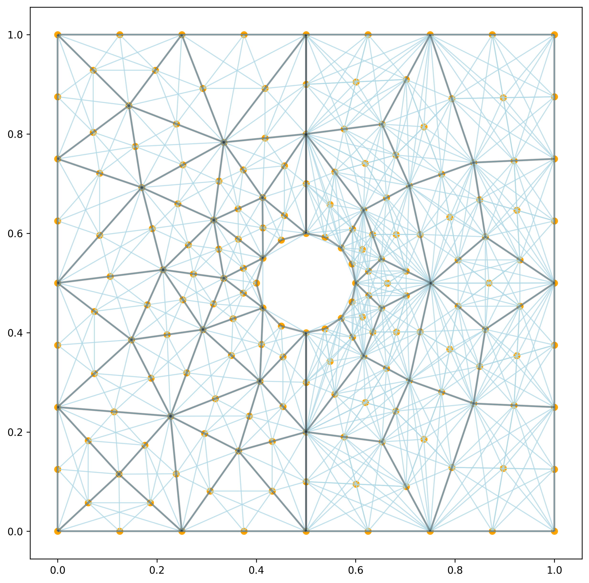
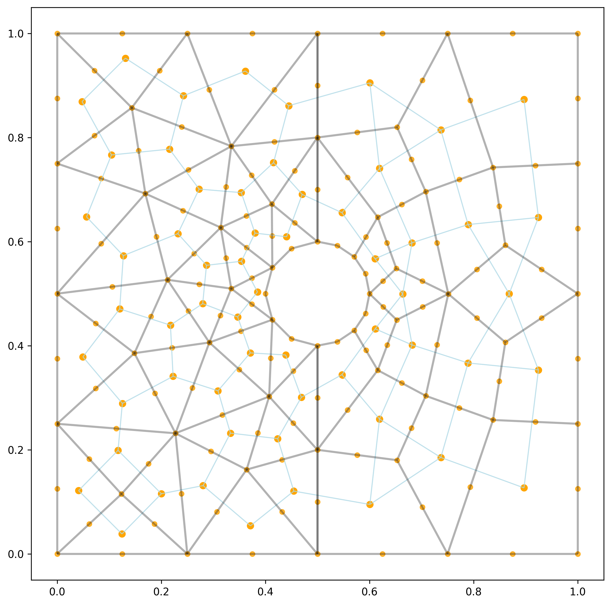

Adjacency 
=========

2D Node Adjacency
----------------

.. code-block:: python 

    from tensormesh import mesh,MeshGen
    import tensormesh as tm
    import tensormesh.visualization as V

    GRAPH_ALPHA = 0.5
    GRAPH_COLOR = "lightblue"
    GRAPH_LINEWIDTH = 1 
    MESH_COLOR = "black"
    MESH_LINEWIDTH = 2

    mesh_gen = tm.MeshGen(element_type=None, chara_length=0.3, order=2)
    mesh_gen.add_rectangle(0,0,0.5,1, element="tri")
    mesh_gen.add_rectangle(0.5,0,0.5,1, element="quad")
    mesh_gen.remove_circle(0.5,0.5,0.1)
    mesh:tm.Mesh = mesh_gen.gen()
    ax = V.draw_graph(mesh.node_adjacency(), mesh.points, 
                      color=GRAPH_COLOR,
                      linewidth=GRAPH_LINEWIDTH,
                      alpha=GRAPH_ALPHA)
    mesh.plot(ax=ax, edgecolor=MESH_COLOR, linewidth=MESH_LINEWIDTH)

2D Element Adjacency
--------------------

.. code-block:: python

    from tensormesh import mesh,MeshGen
    import tensormesh as tm
    import tensormesh.visualization as V

    GRAPH_ALPHA = 0.5
    GRAPH_COLOR = "lightblue"
    GRAPH_LINEWIDTH = 1 
    MESH_COLOR = "black"
    MESH_LINEWIDTH = 2

    mesh_gen = tm.MeshGen(element_type=None, chara_length=0.3, order=2)
    mesh_gen.add_rectangle(0,0,0.5,1, element="tri") 
    mesh_gen.add_rectangle(0.5,0,0.5,1, element="quad")
    mesh_gen.remove_circle(0.5,0.5,0.1)
    mesh:tm.Mesh = mesh_gen.gen()
    points = []
    for key , elements in mesh.elements().items():
        points.append(mesh.points[elements].mean(-2))
    points = torch.cat(points, 0)

    ax = V.draw_graph(mesh.element_adjacency(), points,
                      color=GRAPH_COLOR,
                      linewidth=GRAPH_LINEWIDTH,
                      alpha=GRAPH_ALPHA)
    mesh.plot(ax=ax, edgecolor=MESH_COLOR, linewidth=MESH_LINEWIDTH)
    

3D Node Adjacency
-----------------

.. code-block:: python

    from tensormesh import mesh,MeshGen
    import tensormesh as tm
    import tensormesh.visualization as V

    GRAPH_ALPHA = 0.5
    GRAPH_COLOR = "lightblue"
    GRAPH_LINEWIDTH = 1 
    MESH_COLOR = "black"
    MESH_LINEWIDTH = 2

    mesh_gen = tm.MeshGen(element_type=None, chara_length=0.1, order=1, dimension=3)
    mesh_gen.add_cube(0,0,0,1,1,1,element="tet")
    # mesh_gen.remove_sphere(0.5,0.5,0.5,0.1)
    mesh:tm.Mesh = mesh_gen.gen()
    ax = V.draw_graph(mesh.node_adjacency(), mesh.points,
                      color=GRAPH_COLOR,
                      linewidth=GRAPH_LINEWIDTH,
                      alpha=GRAPH_ALPHA)
    fig = ax.get_figure()
    mesh.plot(ax=ax, edgecolor=MESH_COLOR, linewidth=MESH_LINEWIDTH)
    
.. raw:: html

    

        <iframe src="../_static/plot_mesh/node_adj_3d.html" width="600px" height="500px"></iframe>
    

3D Element Adjacency
--------------------

.. code-block:: python

    from tensormesh import mesh,MeshGen
    import tensormesh as tm
    import tensormesh.visualization as V

    GRAPH_ALPHA = 0.5
    GRAPH_COLOR = "lightblue"
    GRAPH_LINEWIDTH = 1 
    MESH_COLOR = "black"
    MESH_LINEWIDTH = 2

    mesh_gen = tm.MeshGen(element_type=None, chara_length=0.2, order=1, dimension=3)
    mesh_gen.add_cube(0,0,0,1,1,1,element="tet")
    # mesh_gen.remove_sphere(0.5,0.5,0.5,0.1)
    mesh:tm.Mesh = mesh_gen.gen()
    ax = V.draw_graph(mesh.element_adjacency(), mesh.points[mesh.elements()].mean(-2),
                      color=GRAPH_COLOR,
                      linewidth=GRAPH_LINEWIDTH,
                      alpha=GRAPH_ALPHA)
    fig = ax.get_figure()
    mesh.plot(ax=ax, edgecolor=MESH_COLOR, linewidth=MESH_LINEWIDTH)
    
.. raw:: html

    

        <iframe src="../_static/plot_mesh/ele_adj_3d.html" width="600px" height="500px"></iframe>
    
