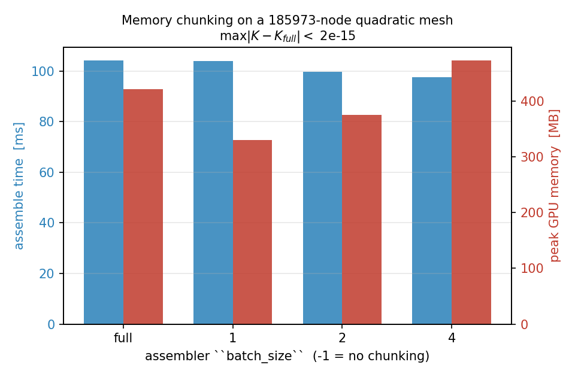
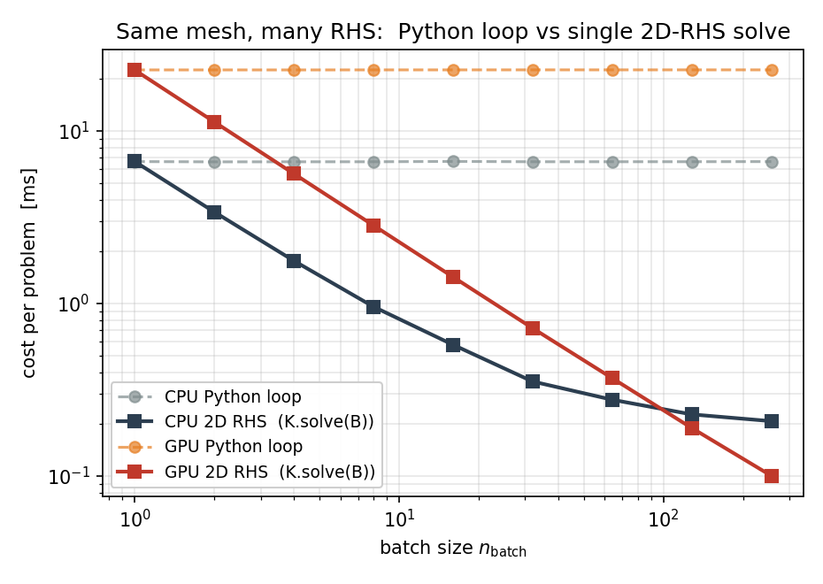
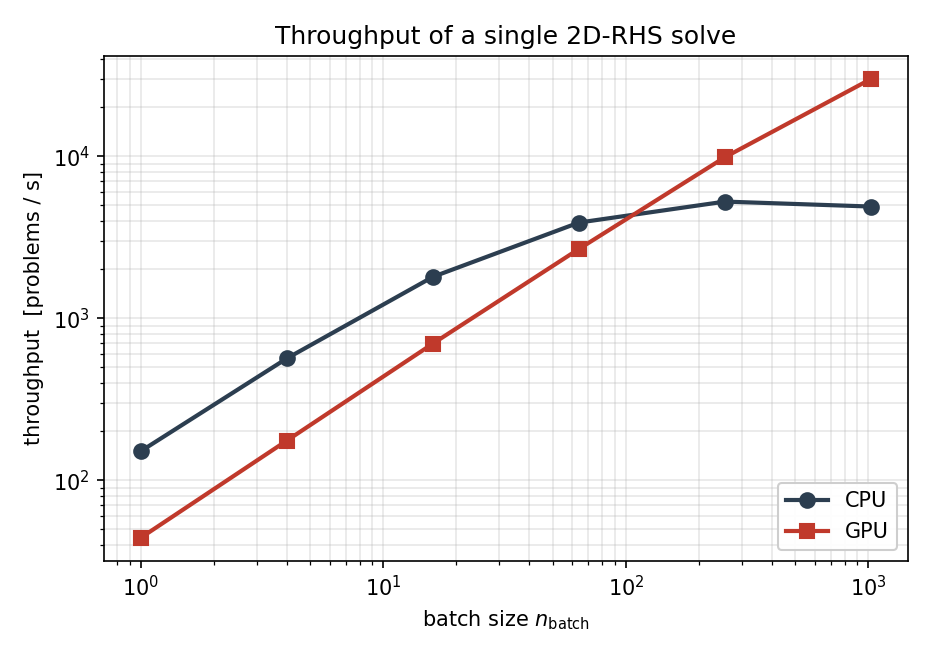

Batched Workflows
=================

"Batched" means three different things in TensorMesh, and they
operate at different layers of the pipeline. Picking the right one
for your problem matters more than turning every knob at once. This
chapter walks through the three axes, then gives the canonical
"same mesh, many sources" recipe with end-to-end numbers measured
on the development workstation.

Three axes of batching
----------------------

.. list-table::
   :header-rows: 1
   :widths: 28 28 44

   * - Axis
     - Where it lives
     - When to reach for it
   * - **Memory chunking**
     - ``Assembler(batch_size=N)``
     - One assembly that doesn't fit in GPU memory.
   * - **Batched right-hand sides**
     - ``K.solve(B)`` with ``B`` of shape ``[n_dof, n_batch]``
     - Many loads, one mesh, one stiffness matrix.
   * - **Multi-problem datasets**
     - :mod:`tensormesh.dataset`
     - ML training data: many ``(K_i, b_i)`` pairs.

What is **not** built in: vmap-style assembly that vectorises ``K``
construction across many parameter values. If you need that, loop
in Python or wrap your assembler call in ``torch.vmap`` manually --
see :ref:`batched-not-built-in` below.

Axis 1 -- Memory chunking with ``batch_size``
---------------------------------------------

A single :class:`~tensormesh.ElementAssembler` call holds the
per-element, per-quadrature-point integrand tensor in memory. For
fine meshes or high-order elements that tensor can be too large.
The ``batch_size`` argument splits the quadrature dimension into
chunks, accumulating the contribution one chunk at a time:

.. code-block:: python

   K = LaplaceElementAssembler.from_mesh(mesh)(batch_size=4)

The result is **bit-identical** (to machine precision) to the
un-chunked call -- ``batch_size`` is purely a memory knob. Default
is ``-1`` (no chunking, fastest if memory allows).

The figure below times the same assembly on a quadratic-triangle
mesh with about :math:`1.9\times10^{5}` nodes on the GPU. The
chunked variants trade a little extra kernel-launch overhead for a
proportional drop in peak memory; the difference at the end of each
bar pair is at most :math:`\sim 2 \times 10^{-15}`, i.e. round-off:

   Assembly time (blue) and peak GPU memory (red) versus the
   ``batch_size`` chunk knob on a quadratic triangle mesh
   (185 973 nodes). Each setting produces a stiffness matrix that
   differs from the un-chunked reference by less than
   :math:`2 \times 10^{-15}` in max-norm.

A typical recipe: start with the default; if you OOM, halve
``batch_size`` until the assembly fits.

This axis has nothing to do with batching across *problems*. The
result is one matrix, not a batch of matrices.

Axis 2 -- Batched right-hand sides
----------------------------------

When you have one stiffness matrix ``K`` and many load vectors
``b_i``, stack the loads into a single ``[n_dof, n_batch]`` tensor
and let the solver factor ``K`` once. :meth:`tensormesh.sparse.SparseMatrix.solve`
auto-routes a 2D RHS to a direct LU factorisation: **one
factorisation, ``n_batch`` back-substitutions**:

.. code-block:: python

   B = torch.stack([b_1, b_2, ..., b_64], dim=1)   # [n_dof, 64]
   X = K.solve(B)                                  # [n_dof, 64]

The speedup over a Python loop of independent solves is dramatic
on both CPU and GPU, and grows linearly with ``n_batch`` until the
back-substitution starts to dominate:

   Per-problem cost on a 3014-node Poisson mesh: a Python loop
   that calls :meth:`tensormesh.sparse.SparseMatrix.solve` ``n_batch`` times
   (dashed) versus a single 2D-RHS call (solid). On the GPU the
   speedup reaches ``225x`` at ``n_batch = 256``.

The lesson reads cleanly off the figure. The loop is exactly
``n_batch`` independent solves, so each tick on the x-axis
doubles its wall time. The 2D-RHS call factors ``K`` once and
amortises that cost across every column; on the GPU it stays
within :math:`\sim 15\%` of the single-RHS time up to
``n_batch = 256``.

Throughput is the same data the other way around -- problems
solved per second:

   Throughput in problems per second. The CPU path saturates the
   SuperLU back-substitution around :math:`5 \times 10^{3}` problems
   per second; the GPU keeps climbing to nearly
   :math:`3 \times 10^{4}` problems per second at
   ``n_batch = 1024``.

Condensation works the same way. :meth:`~tensormesh.Condenser.condense_rhs`
accepts ``[n_dof, ...]`` shapes -- the leading DOF axis is sliced
and the trailing axes pass through:

.. code-block:: python

   condenser = Condenser(mesh.boundary_mask)
   K_, _    = condenser(K, torch.zeros(mesh.n_points))
   B_inner = condenser.condense_rhs(B)             # [n_inner, 64]
   X_inner = K_.solve(B_inner)                     # [n_inner, 64]
   X_full  = condenser.recover(X_inner)            # [n_dof, 64]

This is the workhorse pattern for ML training-data generation and
for parametric studies where every problem shares the geometry.

Axis 3 -- Multi-problem datasets
--------------------------------

For ML workloads where you want many ``(input, output)`` pairs,
:mod:`tensormesh.dataset` bundles two things:

* :class:`~tensormesh.MeshGen` -- programmatic Gmsh-backed mesh
  generation from CSG primitives (rectangles, circles, holes, …).
* Multi-frequency equation classes that emit batched source terms
  with known analytical solutions, for supervised training:

  * :class:`~tensormesh.dataset.PoissonMultiFrequency` (and ``…3D``)
  * :class:`~tensormesh.dataset.HeatMultiFrequency`
  * :class:`~tensormesh.dataset.WaveMultiFrequency`
  * ``LinearElasticityMultiFrequency`` (and ``…3D``)

Each ``…MultiFrequency`` class samples random Fourier coefficients
for the source term and -- where applicable -- returns the
analytical solution at the same nodes, which is convenient for both
training and validation.

The standard "same mesh, varying source" recipe combines this
generator with the batched-RHS pattern from Axis 2:

.. code-block:: python

   import torch
   from tensormesh import Mesh, LaplaceElementAssembler, MassElementAssembler, Condenser
   from tensormesh.dataset import PoissonMultiFrequency

   device = "cuda" if torch.cuda.is_available() else "cpu"

   mesh      = Mesh.gen_rectangle(chara_length=0.02).to(device)
   K         = LaplaceElementAssembler.from_mesh(mesh)().double()
   M         = MassElementAssembler.from_mesh(mesh)().double()
   condenser = Condenser(mesh.boundary_mask)
   K_, _     = condenser(K, torch.zeros(mesh.n_points, device=device))

   # 1024 random Poisson source terms, all evaluated at the same nodes.
   eq = PoissonMultiFrequency(a=torch.rand(1024, 8, 8, device=device) * 2 - 1)
   f  = eq.source_term(mesh.points, domain="rectangle").double()  # [1024, n_points]
   b  = M @ f.T                                                   # [n_points, 1024]
   b_ = condenser.condense_rhs(b)                                 # [n_inner, 1024]
   u_ = K_.solve(b_)                                              # [n_inner, 1024]
   u  = condenser.recover(u_)                                     # [n_points, 1024]

On a single RTX PRO 6000 the loop above produces 1024 Poisson
solutions in roughly 34 ms (see the throughput figure above) --
about :math:`30\,\mu\mathrm{s}` per problem, dominated by the LU
back-substitution. The fully benchmarked driver, with timing
across many ``n_batch`` values, lives in
``examples/dataset/poisson/poisson_dataset.py``.

For *varying mesh* workflows, regenerate ``Mesh`` per problem and
pay the assembly cost each time -- there is no shortcut for that
case today.

.. _batched-not-built-in:

What's not built in
-------------------

There is **no** built-in vmap-style assembler that vectorises
``K`` construction across many parameter values (e.g. one ``K``
per realisation of a stochastic coefficient field). For now two
patterns work in user code:

* **Python loop** -- simplest, fine when assembly is cheap relative
  to solve.
* **``torch.vmap`` around the assembler call** -- works when the
  varying parameter enters via ``point_data`` or ``element_data``
  and the result is uniform in shape. Note that ``vmap``'s
  interaction with sparse output is fragile; test on small
  problems first.

A first-class batched-assembly API may show up in a future release;
the dataset workflow above covers the most common case (same mesh,
many sources) without it.

Reproducing the numbers
-----------------------

All three figures on this page come from a single script:

.. code-block:: bash

   python docs/scripts/batched_workflows_figures.py

It uses only the public API and runs on CPU alone (the GPU panels
are skipped on a CPU-only machine). On a CUDA host it writes
``batched_rhs_scaling.png``, ``throughput.png``, and
``memory_chunking.png`` into
``docs/source/_static/user_guide/batched_workflows/``.

What's next
-----------

* :doc:`linear_solvers` -- the SuperLU auto-routing and the
  ``backend`` knobs that affect batched solves.
* :doc:`differentiability` -- backprop through a batched pipeline.
* :doc:`time_integration` -- transient problems where the inner
  solve at every time step is itself batched-RHS-shaped.
